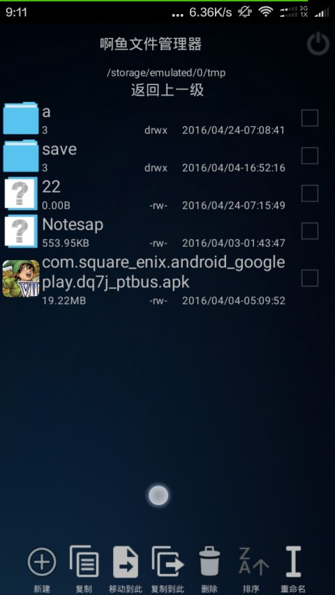
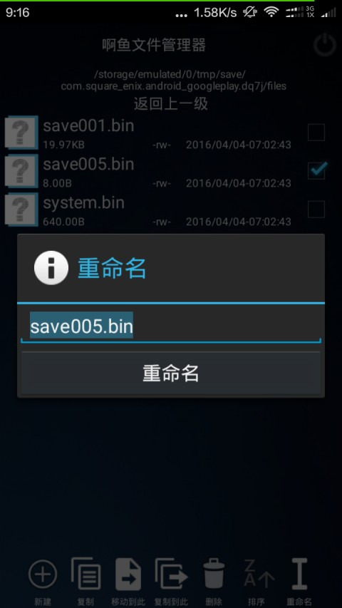
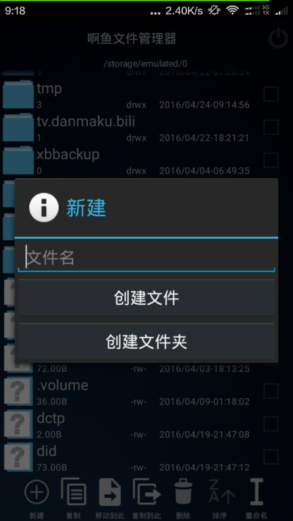
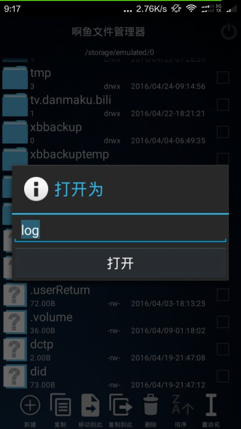
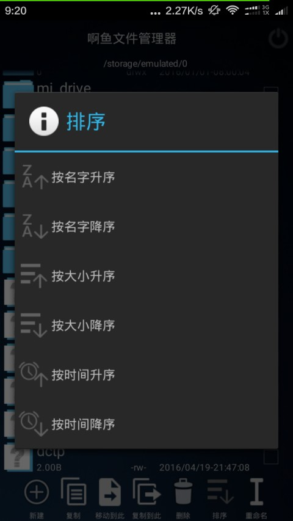
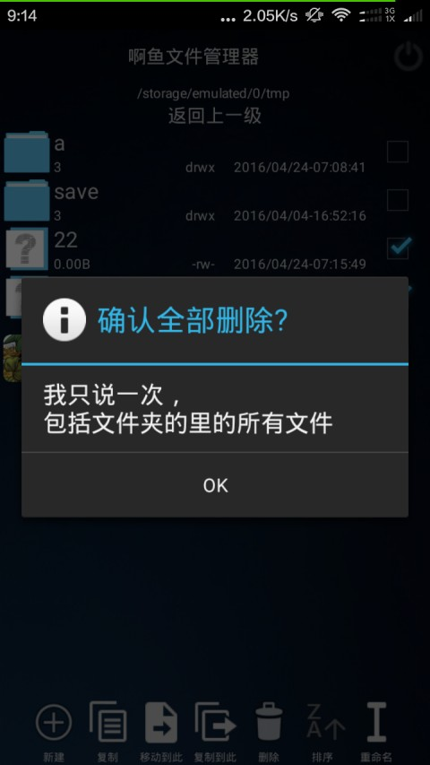
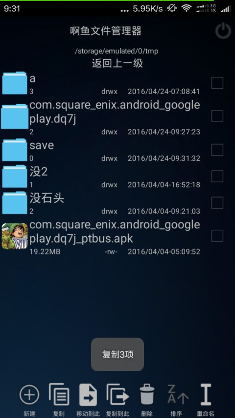

#啊鱼文件管理器
文件类型只识别3种，
文件夹，app安装包，其他文件，

有删除，只确认一次，  

有复制粘贴，但和一般的不同，  
复制是将选中的文件加到剪切板，  
粘贴分两种，都是取出剪切板里第一个文件列表  
一种是移动到指定位置，也就是原本的文件就没了，  
一种是复制到指定位置，也就是原本的文件还存在，  
还有，遇到重名的直接覆盖不询问，
但是如果出现自己复制到自己，  
是什么都不做直接返回复制成功，  

有排序功能，  
有按名字，按大小，按时间排序，  
没有按文件类型，感觉并没有什么意义，  

长按文件是“打开为”，  
和别的文件管理器不一样，  
这个打开为是自己输入后辍,然后得到mime type，然后打开，  
但是还不完美，  
有的应用是自己检查后辍自己判断文件类型，  
比如百度输入法只能打开后辍为bds的皮肤文件，  
再比如c4droid只能打开c源码文件，  
还有AIDE打开java源码文件，  
这些都是无视mime自己判断是否可以打开，  
这些还没想到办法解决，  

重命名功能有点特殊，
可以带斜杆/，也就是可以重命名后移动到其他目录下  

到此已经可以做为基本的文件管理器使用了，  

-------------
图标素材几乎都来自ES文件管理器，  

